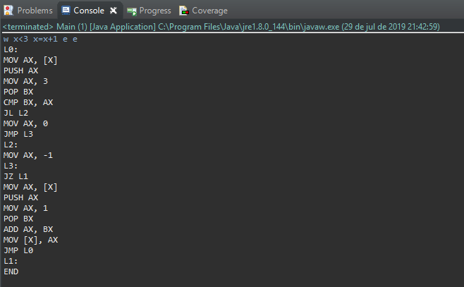
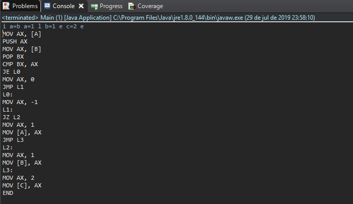

# Mini Compilador em Java

  Projeto desenvolvido na disciplina de Compiladores(7º Período) do curso de Ciência da Computação, o qual implementa a simulação de um compilador simples.
  
  O objetivo principal deste projeto foi estudar o funcionamento de um Compilador, desde analise léxica e sintática, até a geração de código objeto. Por esta razão, a análise léxica foi bastante simplificada, direcionando o foco do projeto para o processamento da gramática e geração de código objeto. 
  
  Para facilitar o entendimento do projeto e dos códigos fonte utilizados nas capturas de tela, irei escrever abaixo representações similares à C.
  
##### Captura 1:
while (x < 3)

{

x = x + 1;

}

##### Captura 2:
if (a == b)

{
  
  a = 1;

}

else

{
  
  b = 1;

}

c = 2;

#### Capturas de tela:

##### *Observação: O "e" signfica o fim de um bloco de código, e o último "e" significa fim do programa.*
